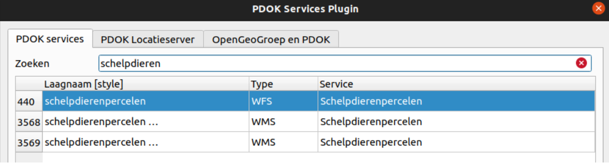
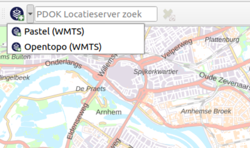
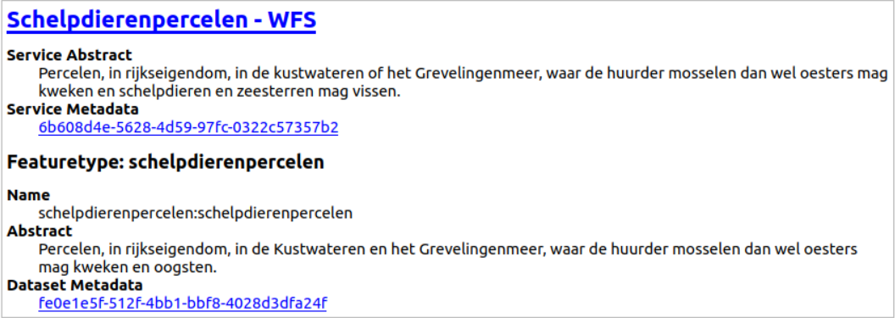
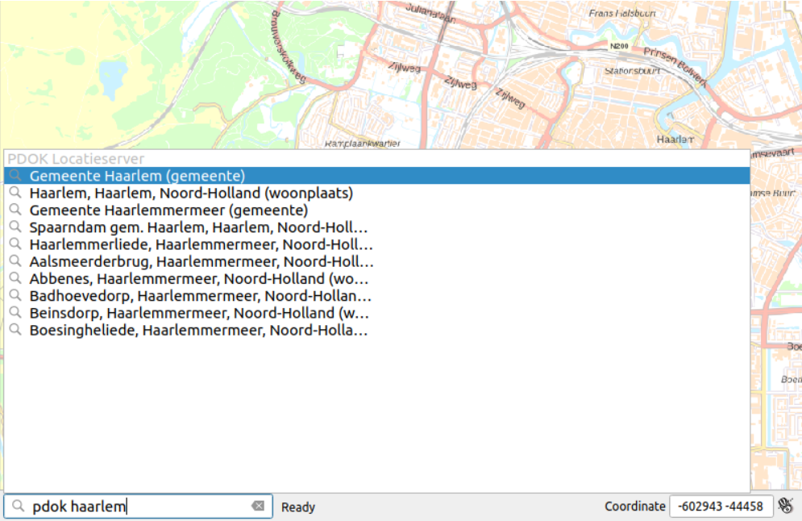
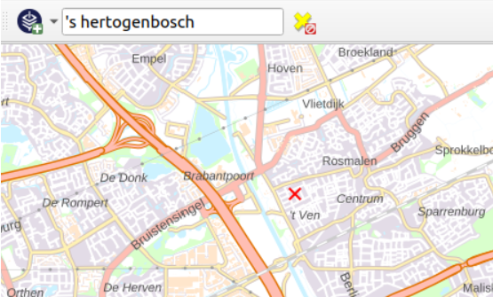
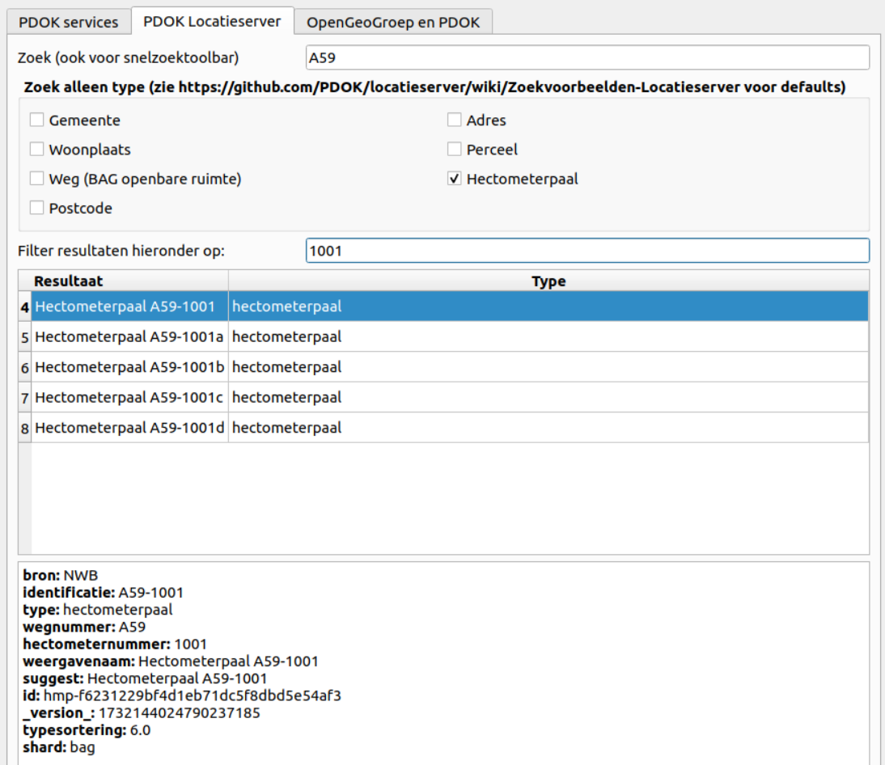
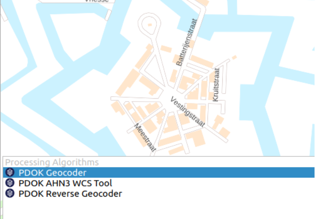

# QGIS PDOK Services Plugin

De *PDOK Services Plugin* is een plugin om eenvoudig PDOK services binnen QGIS te gebruiken. Hieronder zijn de verschillende features van de plugin beschreven. 

## Eenvoudige toegang tot alle PDOK services in QGIS

- Alle beschikbare kaartlagen (WMS/WMTS/WFS/WCS) van PDOK snel doorzoekbaar

- Snelle toegang tot twee favoriete kaartlagen

- Uitgebreide laaginformatie in laag informatiepanel (inclusief metadata links)

## PDOK Locatieserver Integratie in QGIS

- Locatieserver search via de locator bar

- Snelle toegang tot Locatieserver search via de toolbar

- Locatieserver panel met geavanceerde filter mogelijkheden

## PDOK Processing Tools

- Snelle toegang to processing tools via de locator bar

### Processing Tool - PDOK Geocoder

Transformeer locatie namen (adressen, plaatsnamen etc.) in geometrieën met behulp van de PDOK Locatieserver.

**Voorbeeld usecase:** transformeer een CSV bestand met adressen naar een GeoPackage file met punt geometrieën met een adres attribuut. 

### Processing Tool - PDOK Reverse Geooder

Transformeer geometrieën in locatie namen (adressen, plaatsnamen etc.) met behulp van de PDOK Locatieserver.

**Voorbeeld usecase:** transformeer een Geopackage bestand met punt geometrieën naar een GeoPackage bestand met punt geometrieën met een adres attribuut. 

### Processing Tool - PDOK AHN3 WCS Tool

Ophalen van hoogte waardes (elevatie) voor punt geometrieën op basis van de AHN3 Web Coverage Service (WCS).

**Voorbeeld usecase:** transformeer een Geopackage bestand met punt geometrieën naar een GeoPackage bestand met punt geometrieën met een hoogte attribuut. 

